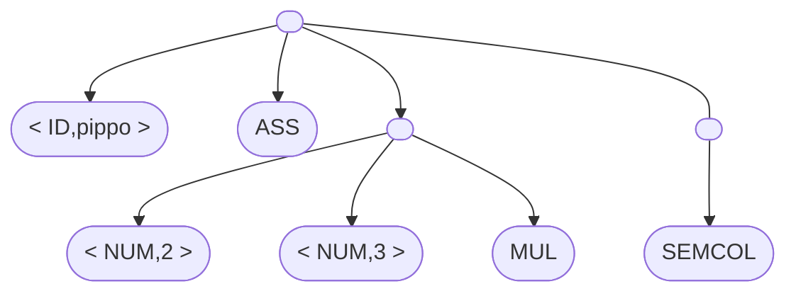
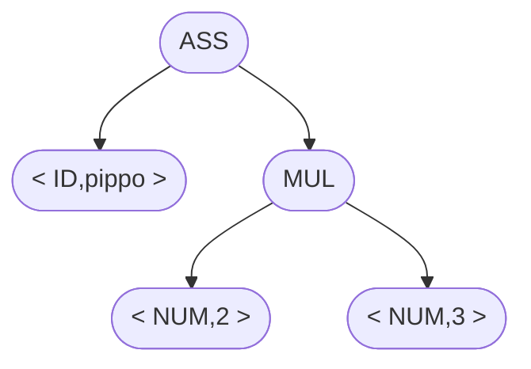

# Compiling pipeline
## Grammar
Defines the form of an assignment. 

## Process
The compilation pipeline is as follows:
1. **Lexic analysis**: **translation** of identifiers **into tokens**
	- Ex: `pippo = 2*3;` -> `<ID,pippo> ASS <NUM,2> MUL <NUM,3> SEMCOL`
2. **Syntax analysis**: check if the **tokens follow the given grammar**
	- if the syntax is correct, it generates a **parse tree** from which **determines an abstract syntax tree**

$$
\Downarrow
$$

3. **Semantic analysis**: checks if the **data is of the expected type**
4. **Intermediate code generation**: **converts the parse tree** into intermediate code
5. **Target code generation**: **converts** intermediate code **into target machine code**

#### Front-end & Back-end
This categorization **divides the first 4 steps and the target code generation**

> [!Info]- Modulatity
> $N$ languages generate $N$ front-ends, $K$ machine architectures generate $K$ back-ends, resulting in $N\times K$ total compilers
