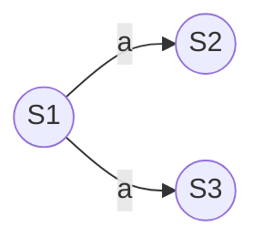

# Recognizing languages
given a language, deducing a state machine is usefull to be used for generating strings

## Regular languages
A regular grammar follows this form:
- A->a
- A->aB
- A->$\epsilon$

## Regular expression
Given $r_1,r_2$ regular expressions and $\mathcal{L}$ as language denoted by $r$, they follow this properties:
- Alternation ($r_1 | r_2$) -> $\mathcal{L}(r_1)\cup\mathcal{L}(r_2)$ 
- Concatenation ($r_1r_2$)  -> {$w_1 w_2\ |\ w_1\in\mathcal{L}(r_1)\ and\ w_2\in\mathcal{L}(r_2)$}
- Kleene star (${r_1}^∗$) -> {$w_1 w_2 ... w_k\ |\ k\geq1, w_k\in\mathcal{L}(r_1)$}
- Parentheses ($(r_1)$) -> $\mathcal{L}(r_1)$ 

All operations have a precendence, in order: ${r_1}^*$ -> $r_1 r_2$ -> $r_1|r_2$ 

# Finite states automata
## Nondeterministic finite state automata
An NFA is a tuple composed of:
- a set of states $\mathcal{S}$ 
- an alphabet $\mathcal{A}$ with $\epsilon\notin\mathcal{A}$ 
- an initial state $s_0\in\mathcal{S}$
- a set of final states $\mathcal{F}\subseteq\mathcal{S}$
- the transition functions $move_n$ 

#### Representation
An NFA is represented graphycally with a graph

tabular representation of the transition functions:
|  |  a|
|--|--|
| $\mathcal{S}_1$ | {$\mathcal{S}_2, \mathcal{S}_3$}|
| $\mathcal{S}_2$ | $\emptyset$
| $\mathcal{S}_3$ | $\emptyset$

>[!Info]- Move example
> The move from the graph on top is written as $move_n(\mathcal{S}_1, a)=\{\mathcal{S}_2,\mathcal{S}_3\}$

#### Accepted languages
An NFA $\mathcal{N}$ **accepts/recognizes** a word $w$ if it exist a path of $\mathcal{N}$ spelling $w$ **from it's initial state to one of the final states**

## Thompson's contruction
Is an algoritm used for constructing an NFA starting from regular expressions, one step at a time.

During the contruction, each step intruduces at most 2 new states, and every intermediate NFA has exactly one final state , no edges incoming in the initial state and no edges outgoing the final state

![[ThompsonConstruction.png]]

#### $\epsilon$-Closure
we define the $\epsilon\text{-}closure(\{t\})$ as the set of states $\mathcal{S}$ which are reachable from $t$ by zero or more $\epsilon$-transitions

> [!Info]- $\epsilon$-closure of a set of states
> $\epsilon\text{-}closure(T)=\cup_{t\in T}\epsilon\text{-}closure(\{t\})$

## Deterministic finite state automata
In an DFA **there is no $\epsilon$-transition**. 
A move is defined as **total** if there is **exactly one** transition for every operation in the alphabet ($a\in\mathcal{A}$). Instead a move is called **partial** if in any state there is at most one transition for every operation.

#### Total transition function
A word is accepted by an DFA only if the end of the word reaches a final state

#### Partial transition function
The difference is that a word can be stopped at any state if it doesn't have the needed operation

In case of overshooting, we can implement a sink state, which has a self loop for all operations in the alphabet

## Subset contruction
Is the operation of converting an NFA into a DFA by using the $\epsilon$-closure

> [!Tip]+ Operatively
> 1. make a table with the starting state as row and the alphabet as columns
> 2. apply $\epsilon$-closure on the starting state, the resulting set will be our $T_0$ state
> 3. find what states are reachable applying the alphabet in the next column, starting from the states composing the row state
> 4. apply the $\epsilon$-closure to those states, if the result is a set different from the ones already achieved, then add a new state $T_n$ row,  else mark the existing state
> 5. repeat step 3 until all columns are done
> 6. repeat step 3 on the next row, until no new rows are generated

#### DFA minimization 
The subset contruction can generate DFA who are bloated, we can use an algoritm to minimize them. The base concept is to find two state the lead to the same simulation and merge them

