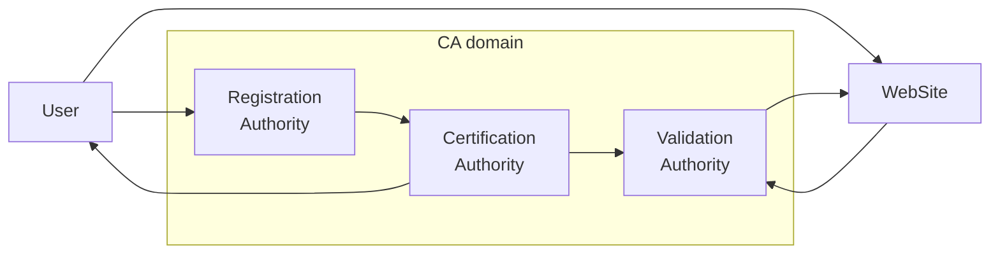
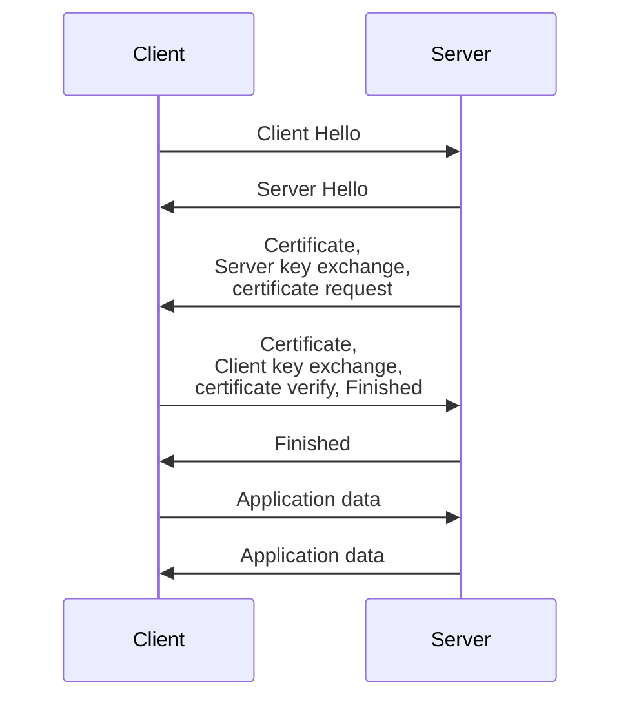

# Introduction
The public key crypto, while **providing integrity, confidentiality and non repudiation**, still **lacks authentication and efficiency**. Additional **infrastructure is required**

## Digital signature
Data that has be **signed with the private key** so that the recipient can use the **public key** of the sender to **verify its origin**. 

This system used hash function for the **signature**, but today **hash functions are considered deprecated**, plus they **don't guarantee the identity** of the user

# Public Key infrastructure
**PKI requires** that the public key is bounded to the **correct identity** and that this bound is **still valid**. 

The initial proposal to bound public keys and identities were bulletin boards. But the widely spread solution is the **use of digital certificates signed by a Trusted Third Party** (TTP)

> [!info]- Case of IOT
> The public key is hardcoded in the software. This prevents any form of scalability and flexability

## Composition

The PKI is composed of 3 enitities:
- The **Certificate Authority** (CA), who **provides the digital certificate** 
- The **Registration Authority**, who **verifies information** for a valid registration.
- The **Validation Authority**, who **checks the validity** for a requested certificate

Additional components are the **Certificate Distribution System** (CDS), which **contains the repository of certificates** and the **Certificate Revocation List** (CRL), and the **Cryptographic Practices Statement** (CPS), a declaration of all **security requirements** issued in the certificate

## Digital Certificates
A certificate contains the issuer, the subject (or user), the public key and the digital signature of the issuer.

#### Procedure to obtain a certificate
1. The user **generates** or is assigned a public and private **key-pair** 
2. The user **requests the certificate** to the CA server
3. The CA **answers with the certificate** including public key **and digital signature**
4. The user **gathers the information** required by the CA
5. The user **send a certificate request** (CSR) to the CA including public key and additional data.
	- The request is digitally signed by the user
6. The CA **verifies the identity** of the user and **generates a certificate binding** the user identity with his public key
7. The CA **issues the certificate** signed by the CA to the user

## Requirements on PKI
- The TTP must be **trustworthy** and **able to check** a party **identity and validity**
- The **relying parties** shall be able to **check the time and general validity** of the certificate
	- One way to do this is through **CRLs** or the  **Online Certificate Status Protocol** (OCSP)
		- **CRLs** are more **efficient** but can miss time windows, meanwhile **OCSP** is always **up to date** but requiring high badwidth
- The cryptographic software and service software of the relying party must be **updated according to the latest known vulnerabilities**

# SSL and TLS
The Secure Sockets Layer and his successor the Transport Layer Security are protocols developed to secure comunications between client and server

#### TLS in the browser
His goal is to **provide** the user with **identity of page origin**. HTTPS (HTTP + TLS) provides the **authentication** and **bidiractional encryption**, **preventing man-in-the-middle**, eavesdropping and tampering attacks.
It also provide **privacy and integrity** 

## TLS
TLS uses **asymmetric cryptography** for **authentication** and **key exchange**, then **symmetric cryptography for confidentiality, integrity and authenticity during communication**
This solution are divided in the **handshake and record protocols**.

During the **handshake**, a set of cryptographic **algorithms is chosen**, the **digital certificates are validated** and the **shared secret enstablished**

It also uses some **additional protocols** like the **Change Cipher Protocol** to **switch to simmetric key encryption**, and the **Alert Protocol** to report failures

#### TLS handshake procedure
1. The clients sends a **hello message** containing the supported **cipher suite**
	- A cypher suite usually **includes key exchange**, **bulk encryption** and **message authentication algoritms**
2. The server answers with the **chosen protocol** and **cipher suite**, plus the **session ID**
3. The **server sends his random server string** used for generating the master key
	- **IF requested**, the server must send an **X.509 certificate** for an authenticated connection.
4. The client **choses a pre-master key**, sends it to the server and uses it to calculate the master key
	- the client **verifies the server certificate** and **sends his own certificate** 
5. The server determins the **beginning** of the use of the **chosen cipher**
	- it's also **sends a finished flag**, an **hash** generated from the entire handshake, used to signal the completition of the algoritm
6. **The communication is now crypted**

#### TLS and authentication
TLS provides authentication for both server and client by **encrypting data** (the pre-master key for the client and the random server string) with the **respective receiver's public key** and **decoding** it with his **own private key**. 
If this **exchange fails**, the **session terminates**.

#### TLS and confidentiality
This **entire communication is encrypted**, this provides confidentiality within the session.

#### TLS and integrity
 TLS **uses a Message Authentication Code** (MAC) to provide data integrity. The MAC uses an **algorithm** composed of cryptographic functions which are **similar to hash functions and digital signatures** but use different security requirements

#### TLS Vulnerabilities
> [!info]+ NB
> Important is the role of **nonces**, 32-**bytes composed of random values and the time**. Nonces are sent, as **identifiers**, with hello messages **to avoid replay attacks**

List of vulnerabilities:
- **RC4NOMORE**:  it abused a weak cipher (RC4) by **observing occurences and guessing tokens** to authenticate as the victim
- **Poodle**:  The attacker asks the server to **downgrade** the connection **to SSL 3.0**, then uses an exploit of SSL 3.0 to **act a Man-In-The-Middle**
- **Bleichenbacher attack**: a vulnerability of SSL, uses the **server response to guess the pre-master secret**. In TLS is fixed as decryption failures are hidden from the attacker
	- **ROBOT**: Return Of Bleichenbacher's Oracle Threat, uses the same principle but aplied to RSA cryptography
- **Heartbleed**: **abuses the extension heartbeat** which kept connections open. The message was **composed of data and datalenght**, from which the server replayed with the same message. But **if the data was shorter than the data lenght**, the server would fill the missing space with data from his memory (**memory leak**), which could have contained sensible information

All this vulnerabilities were using the **weakness of the ciphers or logic failures**, which in successive updates were patched. Right now the **best mitigation** for TLS vulnerabilities are **proper configuration of the TLS server**

## TLS 1.3
This new version containes:
- **Clean-up**: removal of unsafe or unused feature, like a **smaller cipher suites pool**
- **Security**: application of **modern techniques**
- **Privacy**: **more extensive encryption**
- **Performance**: **Faster handshake** (1 RTT and 0 RTT)
- **Backwards compatability**

The faster handshake is achieved by managing the **key exchange with the hello message** and by **ditching RSA and imposing diffie-hellman** for all communication.
It's also **possible to recall data from a previous connection**, enstablishing a 0 round trip-time connection

TLS 1.3 only uses encryption algorithms that **support forward secrecy**
> [!info]+ NB
> **Forward secrecy**, or perfect forward secrecy, is the property that session keys will not be compromised even if long-term secrets are compromised
> In short, it **protects past sessions against future compromises of other keys**

## Ephemeral Diffie-Hellman
This variant of DH that **generates a temporary DH key for every connection**, enabling forward secrecy. 
On the other side this **doesn't allow for authentication**, so **TLS is uses Authenticated Encryption with Associated Data (AEAD)** cyphers, an extension that guarantees confidentiality, integrity and authenticity