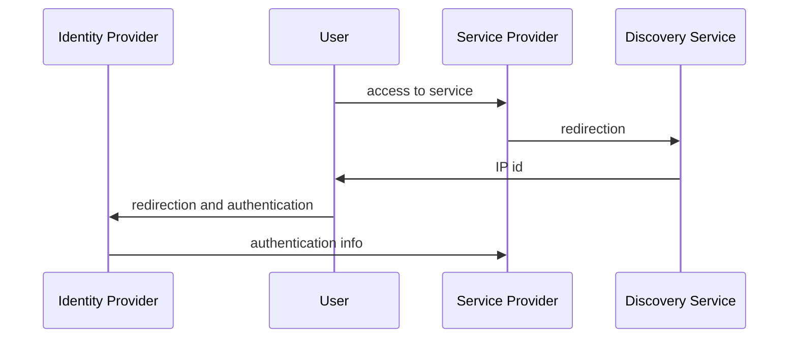
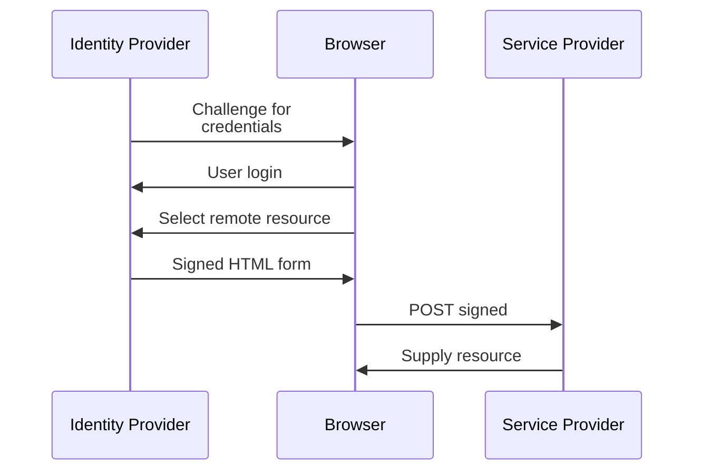
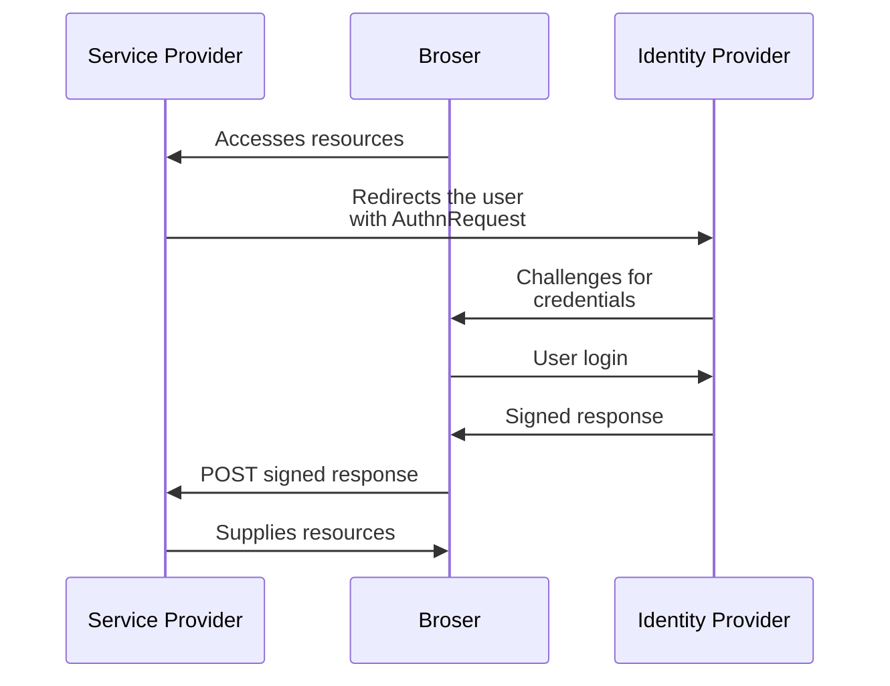
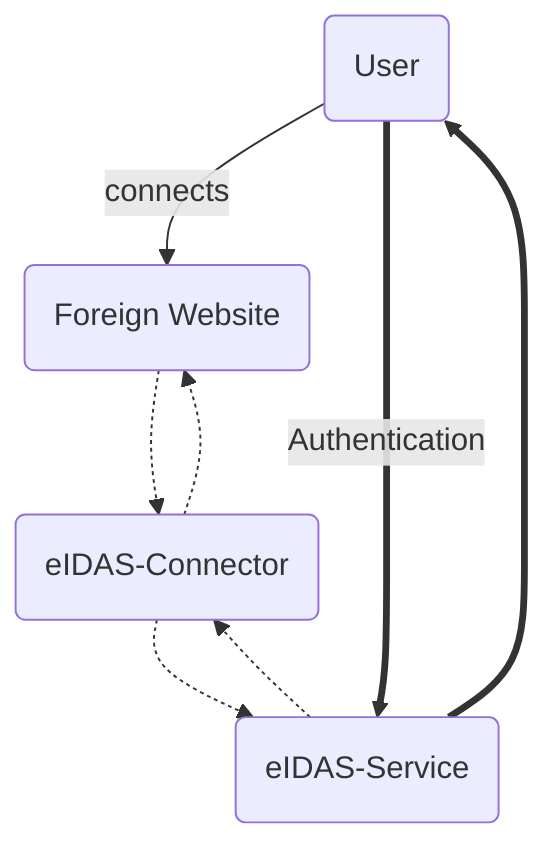

# SSO
The concept is to create a system to allow sharing of security tokens between security domains. This allowes for a **more agile system** and **less password fatigue**

The basic concept is:
1.  an **user access** the application
2. the service provider asks **redirects** authentication **to the identity provider**
3. the identity provider **ask the user for credential** and, if successful, **provides authentication evidence** to the service provider
4. the service provider **gives** to the user an **authentication token**

Using this system, the service provider **must trust** the authentication domain **and use protected communication**. This allowes the **credential to never leave the authentication domain**

# SAML
The Security Assertion Markup Language is a **XML based standard** used to provide an SSO experience

SAML distinguishes two main entities: 
- the **identity provider**, who **authenticates** the user **and provides authorisation information**
- the **service provider**, which **relies on the information** provided by the IsP. 

IdP e SP share  **any type of metadata**, but **at least the entity ID and the cryptographic keys**.

The **authentication flow** follows this procedure:
1.  A user tries to **access** an SP
2.  The user is **redirected to a Discovery Service**
	-  it allowes the user to choose the IdP
3.  The user obtaines the **ID of the IdP**
4.  The user is **redirected to the IdP**
5.  the **Authentication** is performed
6.  The user goes **back to the SP with the authentication**

> [!info]+ NB
> SAML can support various platforms and SAML profiles. The most used profile is **redirect**

## SAML Composition
![[SAML.png]]

#### Assertions
Assertions are the **claims made by the authority**. This claims can be divided in three categories:
- **authentication assertion**: describes the **authentication process** of the user
- **attribute assertion**: defines **information** reguarding the subject
- **authorization assertion**: defines an **action** that the user is entitled to

#### Protocols
It defines the communication and cryptographic **protocols used for the exchange of SAML assertions**

#### Bindings
It's the **type of communication** used to transport the messages **between the actors**. There are various types like SAML URI, **HTTP redirect**, HTTP POST,...

#### Profiles
Profiles combine all components to **create a federation**.  The **most common profiles are Web browser SSO and Single Logout**

##### IsP initiated SSO
1.  A user has an **active login session** in a site
2. The user is **redirected** to a partner website being part of the **same federation**
3. The **first site behaves as the identity provider** and **asserts** to the service provider the **user authentication and attributes**
4. The **SP** uses the received information to **create a local session** for the user

##### SP initiated SSO

> [!info]+ NB
> Is the most common scenario

1.  A user accesses to SP public resources without a login
2. The **user tries to access privileged resources** and is **redirected** to the IP
3. The IP challenges and **authenticates** the user
4. The **IP sends to the SP the assertions** used to validate the user

#### Authentication Context
It indicates **how a user athenticated** at an IdP and with **which level of assurance** (LOA)

#### Metadata
A SAML metadata is used to describe SP, IP and the SAML deployment, **enstablishing trust**. 
The **least required data** is
- **entity ID**
- **cryptographic keys**
- **protocols endpoints** (bindings and URLs).
For authentication, **SAML messages** must be **digitally signed** and **each party must knows each other** in advance.

## SAML Security and privacy
SAML can be **vulnerable to man-in-the-middle or replay attacks**. To avoid these attacks, it **relies on a Public Key infrastructure**. SAML **uses SSL/TLS  and XML Signature** within the HTTP POST binding

Other mechanism used are **expiration timers** and **unique identifiers** for the messages

To guarantee **privacy**, SAML uses **persistent pseudonyms** and **one-time identifiers**, plus it limits the authentication context to the bare minimum for the operations required by the user

# National Identity Infrastructures 
## Spid
The Spid is **SAML 2.0 based** and is managed by the Agency for Digital Italy (AgID).

The **trust is achieved thorugh the intermediation of the agency**, the process of accreditation of digital identity providers, attribute authorities and service providers, **and the shared standard of security policies** guaranteed by SPID

**All the entities** that have passed the accreditation process **are listed in the federation registry** and **for each record is stored**:
- the SAML **identifier**
- **name** of the subject
- **type** of entity
- URL to the service provider's **metadata** 
- list of qualified **attributes**.

## CIE
Used to **store encrypted personal information**, the eletronic Id Card is provided with a **NFC cip** 

# European Identity Infrastructure
An european service used for identification between nations of the EU. 

Country's services are **connected through eIDAS-Nodes**. The node to which a **service connects** is defined as **eIDAS-Connector**, meanwhile, the **node providing authentication**, is called **eIDAS-Service**.
The communication between a connector and a service relies on **SAML**

## EIDAS vulnerabilty
In 2019 was found a **bypass for the signature verification** of new nodes implemented through the eIDAS-Node Integration Package. This allowed to **send manipulated SAML with forged certificates** to vulnerable Nodes

## EIDAS today
Currently EIDAS is under discussion with a **focus on digital wallets**,  empowering the citizen to **selectively share his data**. 

This aims to **self-sovereign identity**, **decentralized identifiers** and **verifiable credentials**.
Currently the EU is developing an **European Self-Sovereign Identity Framework**, or ESSIF, with the use of decentralized identifiers and european **blockchain services**.