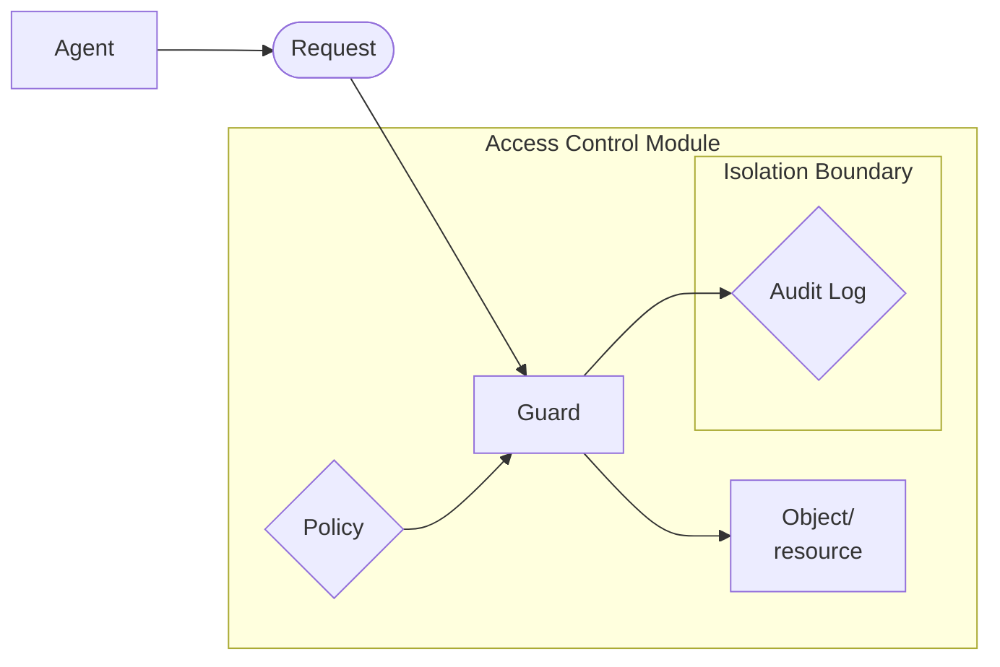
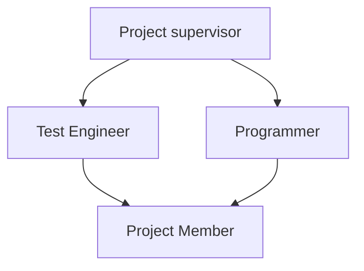
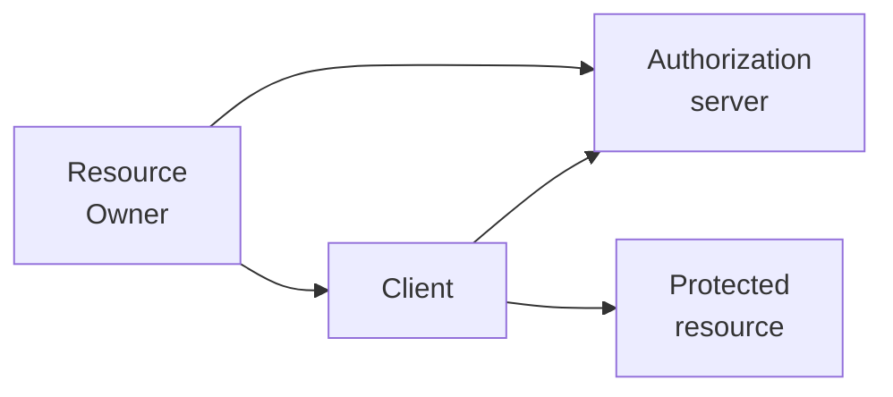

# Introduction

> [!info]+ NB
> The guard is also referred as policy decision point (PDP).
> An agent can be either a subject (user) or an entity (process...)

Some remarks regarding the access control isolation boundaries:
- The **outer boundary** prevents the **by-passing of the guard**. Only privileged user can by-pass it
- the **inner boundary** protects the **integrity of the audit log**

> [!info]+ NB
> **Principle of least priviledge**: every subject must be able to **access only the** information and resources **necessary to performe their task**

> [!info]+ NB
> **Need to know principle**: a process should have **access only to the needed object**, been able to make only **the needed operation** and only **during the needed time**

> [!info]+ NB
> **Domain of protection**: a **tuple composed of objects and access rights**

#### AC definition
An AC is a **process which grants or denies access** to resources of a system. 
Its purpose is to **protect resources** from unauthorized access by **using AC policies**

#### Structured approach
AC are divided in:
- **policies**: rules controlling who can access what
- **model**: formal **representation** of the policy
- **enforcement**: the actual **implementation** of policies

This allowes for the **separation from the implementation and concerns**

> [!info]+ Confused deputy
>  during a privilege escalation attack, the attacker uses another subject, which has access, as an intermediary for reading or modifying the data

# AC models
## AC matrix
Corrisponds as the **base model**, as it lists all subjects and resources, and for **each cell lists the permitted actions**

> [!info] NB
> **List of capabilities**: is the list obtained from the matrix from the point of view of the user
>**Access Control List**: is the list from the point of view of the resources
>
>The list of capabilities and the ACL are **enforcements of the AC Matrix**

#### ACL Vs Capabilities list
The main difference between the two is **vulnerability to a confused deputy attack**: because **capabilities declare the permissions in advance**, an attacker can not use a resource that's not available to him

## Discretionary AC
DAC policies are **determinated by the owner user**. This method is typically used in OSs and usually enforced through ACL.

Users can be arranged in groups, and determine the **policies based on the group** and not the single user

DAC is more **flexible and intuitive**, but it **relies on the user correctness**. DAC are also **vulnerable to trojans**.

## Mandatory AC
Policies are managed by a central identity and enforced with security labels and somethimes legal requirements.

**MAC is rigid**, allowing for **more controlled environment** and **slowing disaster recovery** . It also doesn't stop **information leakage through covert channel**

#### Multi-level security
This model has the objective of **managing information with different sensitivity levels and user with various degrees of trustworthiness**

Information is labeled with a **sensitivity label**, which joins a **linear ordered sensitivity values**  and the **category** of interest groups.

When a resource is created, **the resource creator applies the sensitivity label**.
Also the **user is assigned clearance** (or categorized) based on the **security level** and **categories**.

An user has access to the data based on 4 principles:
- **Domination**: (S1,N1) dominates (S2,N2) if S1 $\geq$ S2 and N1$\supseteq$N2
- **No Read Up property**: A subject can **read** a resource if his **clearance dominates the sensitivity label**
- **No Write Down property**: A subject can **write** a resource if his **clearance is dominated by the sensitivity label** 
- **Tranquility principle**: security labels can't be changed arbitrarily

This principles compose the **Bell-LaPadula security model**, still relevant in modern computer security. This system **mantains confidentiality** but **doesn't prevent lower clearance users to overwrite higher clearance resources**, generating an **integrity problem**

## Role based Access control
**Permission and users are assigned to roles** rather than to each other, **improving user-permission management and additional security benefits**

> [!info]+ Definition
> A role is a collection of permission

RBAC is **easy to visualize and manage**, but **difficult to define roles**.
By assigning permissions to roles, there are **fewer relations to manage**

#### Role hierarchy
RH share many properties with E/R hierarchy. We mantain reflexive, antisymmetric and transitive relations

By convention we use a Hasse diagram with more powerfull roles on top, and less powerfull towards the bottom

#### Core Role Based AC (RBAC)
![[RBAC.png]]

#### Constrainerd RBAC
Adds restrictions to **prevent conflict of interest between policies**

# ABAC
The **Attribute Based Access Control** defines authorizations based on **conditions of resource and subject properties**. ABAC is more **flexible** than other AC

ABAC categorizes attributes in 3 types:
- **User attributes**
- **Resource attributes**
- **Environmental conditions**

ABAC **policies are written from the perspective of the group of resources**. This allowes to **not define a specific user of resource**.

#### Attributes
A **subject** is an entity that changes the system state, and is **defined by his identity** and characteristics

A **resource attribute** can be used to **make access control decisions**

**Environmental attributes** describe the **contexts in which the access occurs**

# XACML
The **eXtensible Access Control Markup Language** is **XML encoded** and used to **specify policies, AC requests, AC decisions** and more.

XACML is composed of:
- **Policy language**
- **request/response protocol**
- **reference architecture**

> [!Info]+ NB
> The **target** defines the conditions to determine which policy applies to the request. It is **used to minimize the policies that must be examined**

**Attributes** used for decision making **are stored in the Policy Information Point**

#### Policies
XACML policies are **structured in PolicySets** and **composed of rules**. **PolicySets may include other PolicySets**.

**Rules evaluate to true, false and indeterminate**, and can be combined with **rule combining algorithms**. Some examples are:
- **Deny overrides** (AND operation on permit)
- **Permit overrides** (OR operation on permit)
- **First applicable** (Uses the first non-indeterminate decision)
- **Only one applicable** (If more than one decisions are non-indeterminate, then the result is indeterminate)

**Policies** also **determine the effect** of rules

#### Obbligations
XACML can include **behaviours** that can be carried out **before and after an access request** is approved or denied

## XACML Architecture
![[XACML.png]]

Components details:
- **Policy Enforcement Point**: the entity protecting the resource, it enforces authorization decisions
- **Context Handler**: converts requests and authorization decisions in XACML format
- **Policy Decision Point**: examines request, retrieves policies and returns the authorization decision
- **Policy Administration Point**: creates and stores security policies
- **Policy Information Point**: manages the data needed for policy evaluation

# OAUTH 2.0
To **avoid exposing your authentication data**, OAUTH allowes you to **grant access to selected private resources** on a **Service Provider site** to a **Consumer/Client site**

The procedure is as it follows:
1. **Authentication**: the user logs into the service provider
2. **User consent**: it's created a Oauth token based on the resources consented by the user
3. **Get OAuthToken**: the consumer obtains the token and access right to the resources
4. **Access resource**: The consumer accesses the resource through the service provider server

We can say that OAuth 2.0 **allowes delegation** of authorization from user to client

**A token is recognized** by the resource server by a **database lookup**, a **query to the authorization server** or by putting **data in the token**

OAuth 2.0 is defined **only for HTTP** (with TLS). It's **not an authentication protocol**, it **doesn't process authorizations** and **doesn't define any token format**. **OAuth is a framework**

> [!warning]+ Why OAuth for authentication is a bad idea
> OAuth is based on the assumption that the possession of a token asserts that a user is authenticated. This leaves open the possibility that the **user is not present within the application**
>
>**OpenID Connect adds key components** to OAuth that allowes to use it for authentication

## JWT
The **JSON Web Token** is the standard token **used for OAuth 2.0**. Is **composed by Header, Payload and Signature**

**Token flow**:
1. The user is **redirected** to the Authorization server
2. The user is **authenticated and authorizes the Client**
3. The user is **redirected** to the client **with an authorization code**
4. The client **sends the authorization code**** to the authorization server **and authenticates** with his credentials
5. The Authentication server **issues an access token** to the client
6. The Client **accesses the protected resource** using the token

> [!Info]- NB*
> Authorization codes are required to avoid replay attack of the access token by requiring the client id and secret

An access token **stops working** only after **expiring or being revocated**. Obtaining a new token requires user input or **refresh tokens**, issued alongside access token

# TakeAways
- XACML is an OASIS standard 
	- It has even a RBAC profile (for both core and hierarchical) 
- A standardized approach to authorization 
	- Authorization rules no more embedded in the SW of individual systems - Focus is on corporate policies rather than the technicalities of SW environments 
- An externalized approach to authorization 
	- PDP offers authorization as a service in the infrastructure 
	- Authorization algorithms can be removed from the application logic of individual information systems, which will then query the PDP via their own Policy Enforcement Points (PEP) 
- An attribute and policy based approach to authorization 
	- XACML policies introduce abstract logic to replace previous static assignments of user permissions 
	- Instead of “Bob can access document X” a rule “any user belonging to company X with security clearance equal to or higher than the security classification of a document should be granted access to that document” 
	- To determine whether Bob should be granted access to document X, his security clearance as well as the document classification needs to be gathered. These descriptive pieces of information are called attributes
- Key mechanism to delegate permissions without distributing credentials 
- Recall to use TLS to secure communications 
- It can be used as the starting point for authentication protocols 
- OpenIdConnect